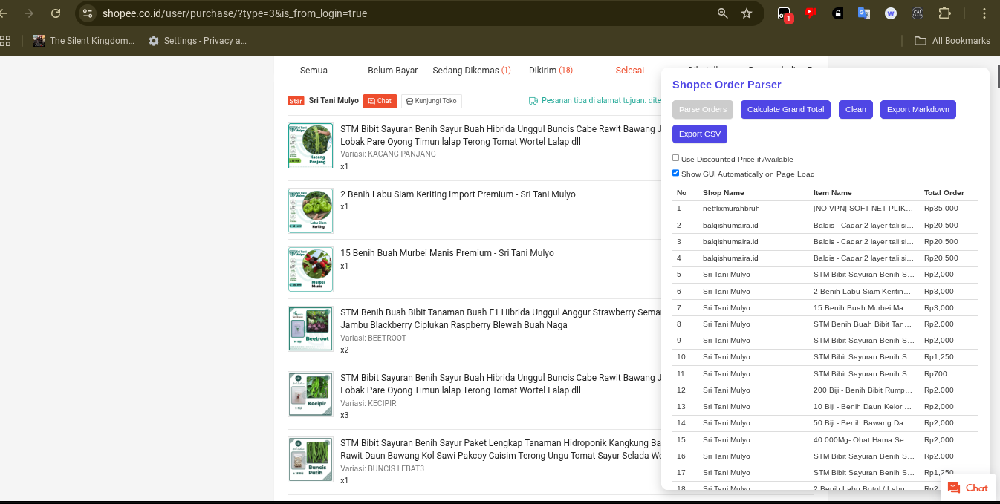
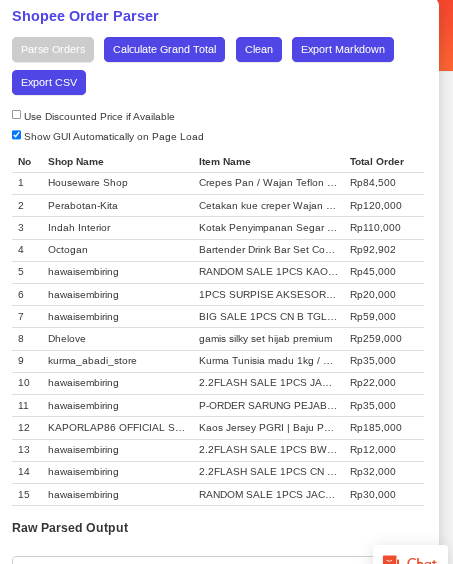
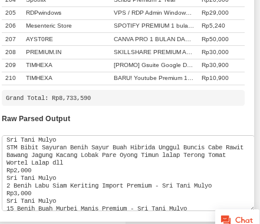

# 🛍️ SSTracker – Shopee Spending Tracker

A modern, user-friendly Tampermonkey script to parse and track your spending on **Shopee Indonesia** (`shopee.co.id`).

🔗 **[Lihat Versi Bahasa Indonesia](#-versi-bahasa-indonesia)**

---

## ✨ Features

- **Instant Order Parsing:** Extracts shop names, item names, and order totals from your Shopee order history page.
- **Grand Total Calculator:** Instantly sums up your total spending on the current page.
- **Export Options:** Download your parsed data as Markdown or CSV (Excel/Sheets-ready).
- **History Tracking:** Save and revisit past parsing sessions.
- **Modern UI/UX:** Clean, accessible, and responsive interface with dark mode support.
- **Customizable Settings:** Toggle discounted price usage, auto-show panel, and more.
- **Keyboard Shortcuts:** Quick access with `Ctrl+M` (toggle) and `Esc` (hide).

---

## 🆕 Recent Improvements

- **UI/UX and Accessibility:**
  - Improved color contrast, focus states, and keyboard navigation for better accessibility.
  - Added ARIA roles and screen reader support for all interactive elements.
  - Enhanced table and button styling for a modern, user-friendly experience.
- **CSV Export for Excel/Sheets:**
  - CSV export now uses a semicolon (;) as the separator for better compatibility with Excel/Sheets in many locales.
  - The exported CSV columns now match the UI and Markdown export: No, Shop Name, Item Name, Total Order.
  - The 'Total Order' column is numeric only (no currency symbol), so you can sum or calculate easily in Excel/Sheets.
  - Grand total row is included at the end of the CSV export.
- **General:**
  - Improved error handling and reliability for parsing Shopee order pages.

---

## 🖼️ Screenshots

  
  
<em>Modern floating panel with parsed order table and export options</em>

  
  
<em>Customizable settings and dark mode support</em>

  
  
<em>Order history tracking and quick loading</em>

---

## 📦 Installation & Usage

1. **Install [Tampermonkey](https://www.tampermonkey.net/)** (or a compatible userscript manager).
2. **Install the script:** [Greasy Fork - SSTracker](https://greasyfork.org/en/scripts/538963-shopee-advanced-order-parser-v3-5) or from the release page.
3. **Go to your Shopee order history page.**
4. **Click "Parse Orders"** in the floating panel at the top-right.
5. **Use the available buttons to:**
   - Calculate your total spending
   - Export results (Markdown or CSV)
   - Clean/reset the output
   - Save/load order history
   - Adjust settings (discount price, dark mode, etc.)

💡 **Tip:** Press `Ctrl + M` to toggle the parser interface, or `Esc` to hide it.

---

## ⚠️ Limitations

- Parses only what is **currently visible on screen** (scroll to load more orders).
- Works and tested only on **Shopee Indonesia** (`*.shopee.co.id`).
- May break if Shopee changes their layout or class names.

---

## 🛠️ Troubleshooting & FAQ

**Q: Why does my CSV export show all data in one column in Excel?**
- Your Excel may use a semicolon (;) as the default separator. This script now exports CSVs with semicolons for compatibility. If you still see all data in one column, use Excel's "Data > From Text/CSV" import and set the delimiter to semicolon.

**Q: Can I use this on Shopee outside Indonesia?**
- This script is designed and tested for Shopee Indonesia only. Other regions may have different layouts.

**Q: Why are some orders missing?**
- The script only parses orders that are visible on the page. Scroll down to load more orders before parsing.

**Q: How do I get the total in Excel?**
- The 'Total Order' column is numeric. You can use Excel's SUM function to calculate the total.

---

## 📁 License

MIT License – You're free to redistribute, modify, and share this script.

> ⚠️ The author is not responsible for any damage or misuse. Use at your own risk.

---

## 🇮🇩 Versi Bahasa Indonesia

---

## 🛍️ SSTracker – Pelacak Pengeluaran Shopee

  

  

> Sebuah skrip sederhana untuk memantau pengeluaran belanja Anda di **Shopee Indonesia** (`shopee.co.id`).

---

## 📌 Apa Itu?

**SSTracker** adalah skrip Tampermonkey yang membantu Anda melacak riwayat pembelian langsung dari halaman pesanan Shopee. Fitur utama:

- ✅ Mem-parse daftar toko, nama barang, dan harga  
- 💰 Menghitung total pengeluaran  
- 🗑️ Membersihkan hasil  
- 📄 Menyimpan ke format Markdown (.md) atau CSV (.csv)

> ⚠️ *Skrip ini tidak menyimpan atau mengubah data akun Anda. Semua aktivitas dilakukan secara lokal di peramban.*

  
  
  

## ✅ Manfaat

- 🧮 Hitung total belanja hanya dalam satu klik  
- 📋 Salin atau ekspor hasil parsing dengan mudah  
- 🛠️ Pengaturan GUI: pilih harga diskon dan tampilkan otomatis  
- 🌐 Bekerja di Firefox dan Chrome  

---

## ⚠️ Kekurangan

- ❗ Hanya memproses konten yang **terlihat di layar**  
- 📍 Hanya di test dan dicoba di **Shopee Indonesia** (`*.shopee.co.id`)  
- 🧱 Dapat rusak jika Shopee mengganti struktur kelas/CSS  

---

## 🧰 Cara Penggunaan

1. 🔧 Instal [Tampermonkey](https://www.tampermonkey.net/)  atau ekstensi serupa  
2. 📥 Instal skrip lewat [Greasy Fork - SSTracker](https://greasyfork.org/en/scripts/538963-shopee-advanced-order-parser-v3-5)   
3. 🛒 Kunjungi halaman **riwayat pesanan Shopee**  
4. 🖥️ Klik tombol **"Parse Orders"** di panel kanan atas  
5. 📊 Gunakan tombol lainnya untuk:
   - Hitung total pengeluaran  
   - Ekspor hasil  
   - Bersihkan data
   - Opsi menunjukan harga asli atau diskon (setting bawaan diskon)  

💡 Tips: Tekan `Ctrl + M` untuk menampilkan/menyembunyikan antarmuka parser.

---

## 📁 Lisensi

MIT License – Anda bebas membagikan, memodifikasi, dan menggunakan skrip ini.

> ⚠️ Penulis tidak bertanggung jawab atas kerusakan atau penyalahgunaan. Gunakan sesuai risiko Anda sendiri.

---

## 🙏 Credits

Special thanks to [pataanggs](https://github.com/pataanggs) for contributing to recent improvements and enhancements to this project.

